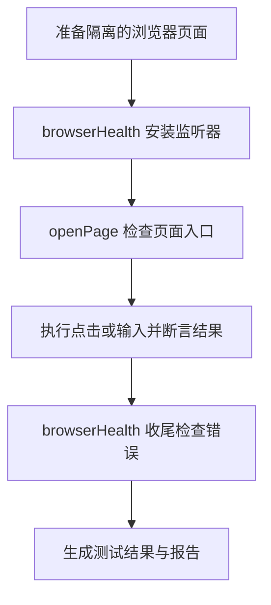

**这是一份面向 Playwright 初学者的 `frontend.spec.ts` 代码导读。**

对应文件：[测试脚本](../tests/smoke/frontend.spec.ts)、[运行配置](../playwright.config.ts)、[部署工作流](../.github/workflows/test-vps-ssh.yml)。部署背景见 [前端部署说明](./frontend-deployment.md)。

`frontend.spec.ts` 会控制一个真实浏览器访问网站，执行用户操作，再检查页面与网络请求是否正常。它会打开首页、点击导航、读取文章列表、操作登录表单。

即使服务器返回 HTTP 200，只要出现脚本报错、文章接口失败、按钮点击无效等问题，测试仍然可能失败。这类围绕关键路径的少量检查通常叫“冒烟测试”：用于尽早发现影响基本使用的故障。

建议按下面的顺序阅读：

1. 认识基本语法：定位元素、执行操作、断言结果。
2. 阅读首页测试和登录表单测试。
3. 阅读文章列表测试，理解如何观察接口请求。
4. 阅读 `openPage()`，理解公共页面检查。
5. 阅读 `browserHealth`，理解测试全过程的错误监听。
6. 对照配置与 GitHub Actions，理解测试如何运行、如何报告失败。

**先用一个简化示例认识基本写法。**

```ts
test('首页能够打开登录页', async ({ page }) => {
  await page.goto('/')

  await page.getByRole('button', { name: 'LOGIN', exact: true }).click()

  await expect(page).toHaveURL(/\/login$/)
})
```

这段代码的意思是：创建一个测试，用浏览器打开首页，点击 LOGIN 按钮，然后确认当前网址以 `/login` 结尾。

| 写法 | 含义 |
| --- | --- |
| `test('名称', 函数)` | 定义一个测试场景，名称会显示在测试报告中 |
| `page` | Playwright 提供的浏览器页面对象，可以理解成受代码控制的标签页 |
| `page.goto()` | 让浏览器访问网址 |
| `getByRole()` | 按元素的语义角色查找元素，例如按钮、链接、标题 |
| `.click()` | 点击找到的元素 |
| `expect()` | 声明预期结果，也叫“断言” |
| `.toHaveURL()` | 检查页面网址是否符合预期 |
| `async` / `await` | 等待打开页面、点击、检查等异步操作完成 |

`page` 不需要自己创建，Playwright 会为测试准备它。默认情况下，每个测试拥有隔离的浏览器上下文，因此前一个测试的 Cookie、登录状态不会自然传给下一个测试。浏览器进程本身可以复用，隔离不等于每条测试都启动一个全新的浏览器进程。[官方 fixture 说明](https://playwright.dev/docs/test-fixtures)

下面的表达式返回一个 Locator，通常叫“定位器”：

```ts
page.getByRole('button', { name: 'LOGIN', exact: true })
```

可以把定位器理解为“描述怎样找到某个元素的对象”。这里要求元素角色为按钮，可访问名称完整匹配 `LOGIN`。对项目中的这个按钮而言，名称来自按钮文字。`exact: true` 避免把名称更长的按钮也匹配进来。

定位之后，可以调用 `.click()`、`.fill()`，也可以把定位器交给 `expect()`，检查对应元素的状态。

**页面断言会等待条件成立，普通值断言会立即检查。**

```ts
expect(response.status()).toBe(200)
```

这行对已经拿到的数字做一次检查。

```ts
await expect(username).toBeVisible()
```

这行是页面断言，会在超时时间内反复检查元素是否可见。元素第一次检查时尚未出现，并不意味着马上失败。当前项目的断言等待上限配置为 10 秒，实际等待也受测试总超时约束。[官方断言说明](https://playwright.dev/docs/test-assertions)

因此，不需要为每个页面操作手动写“固定等待 3 秒”。这里通过条件判断决定何时可以继续。

**首页测试检查首页展示，以及通过 LOGIN 按钮进入登录页的过程。**

对应测试名：`homepage renders this release and client navigation works`。

```ts
test('homepage renders this release and client navigation works', async ({ page }) => {
  await openPage(page, '/')
  await expect(page.getByRole('heading', {
    name: 'Welcome to Gerden Blog!',
    exact: true,
  })).toBeVisible()
  await expect(page).toHaveTitle('Gerden Blog - Welcome')

  await page.getByRole('button', { name: 'LOGIN', exact: true }).click()
  await expect(page).toHaveURL(/\/login$/)
  await expect(page.getByPlaceholder('USERNAME', { exact: true })).toBeVisible()
})
```

`openPage(page, '/')` 是项目自己封装的函数。它打开页面，并检查状态码、发布版本和 Vue 挂载状态，后文会展开。

随后两条断言检查不同位置：

- `getByRole('heading', ...)` 检查页面正文中的标题，例如 `<h1>`。
- `toHaveTitle()` 检查 HTML 的 `<title>`，也就是浏览器标签页标题。

然后点击 LOGIN，并检查网址和用户名输入框。

`/\/login$/` 是正则表达式。其中 `\/` 匹配斜杠，`$` 表示结尾，所以它要求网址以 `/login` 结束。

`getByPlaceholder('USERNAME', { exact: true })` 则通过输入框的 `placeholder="USERNAME"` 找到它。

这个场景可以发现首页内容错误、LOGIN 点击无效、跳转后登录表单没有出现等问题。它检查点击后的结果，没有额外断言导航过程中是否发生整页刷新。

**登录表单测试检查输入框能否操作，以及前端用户名校验是否生效。**

对应测试名：`login form is usable and client validation works without submitting`。

```ts
await openPage(page, '/login')

const username = page.getByPlaceholder('USERNAME', { exact: true })
const password = page.getByPlaceholder('PASSWORD', { exact: true })

await expect(username).toBeEditable()
await expect(password).toBeEditable()
await expect(password).toHaveAttribute('type', 'password')
await expect(page.getByRole('button', {
  name: 'Login',
  exact: true,
})).toBeEnabled()
```

这段要求用户名和密码输入框可以编辑、密码框使用 `type="password"`，并且登录按钮未被禁用。

按钮处于启用状态，只能说明当前可以操作，不能说明登录认证已经成功。

随后检查空用户名：

```ts
await username.focus()
await username.blur()
await expect(page.getByText('Format Error', { exact: true })).toBeVisible()
```

操作顺序是：聚焦用户名输入框，保持内容为空，再移走焦点，最后检查错误提示。

使用 `blur()` 的原因在于 [登录页面](../app/pages/login.vue) 把校验绑定到了失去焦点事件：

```vue
<input
  v-model="form.username"
  @blur="validateUname"
>
```

对应的业务规则是：

```ts
usernameError.value =
  form.username === '' ||
  form.username.length > 64
```

因此，空用户名失去焦点后应显示 `Format Error`。

再输入符合规则的内容：

```ts
await username.fill('smoke-reader')
await username.blur()
await expect(page.getByText('Format Error', { exact: true })).toHaveCount(0)
```

`fill()` 填入输入框内容；再次 `blur()` 触发校验；`toHaveCount(0)` 要求错误提示元素数量变为 0。

这里使用元素数量检查，是因为页面通过 `v-if` 控制错误提示。校验通过后，该元素会从 DOM 中移除。

`smoke-reader` 只是测试输入，不需要真实存在这个账号。这个测试没有提交表单，也没有验证密码认证、登录 Cookie、登录后状态或密码校验的所有分支。

**文章列表测试会把真实接口响应与页面展示对照起来。**

对应测试名：`posts API succeeds and its results render, including an empty list`。

先打开首页，再点击 POSTS：

```ts
await openPage(page, '/')

const [response] = await Promise.all([
  page.waitForResponse(response =>
    response.url() === postsURL &&
    response.request().method() === 'GET'
  ),
  page.getByRole('link', { name: 'POSTS', exact: true }).click(),
])
```

项目使用 Nuxt 服务端渲染。直接访问 `/posts` 时，数据可能由 Nuxt 服务器请求，再随页面内容发送到浏览器。从首页点击进入文章页，可以让这个场景覆盖浏览器发起文章接口请求的路径。

`page.waitForResponse()` 观察浏览器收到的响应，等待符合条件的那一个。这里要求响应 URL 完全等于 `postsURL`，请求方法为 GET。

它本身不会发送请求。真正发送请求的是点击后运行的页面业务代码。

`Promise.all()` 将等待响应和点击组合起来，并先注册响应等待：

```text
开始等待目标响应
        ↓
点击 POSTS
        ↓
页面发出 GET 文章接口请求
        ↓
捕获目标响应，并等待点击操作完成
```

如果先等待点击完成，之后才监听响应，接口足够快时可能已经错过响应事件。

`Promise.all()` 返回的结果顺序与传入任务顺序一致。`const [response]` 是数组解构，只取第一个任务的结果，也就是等待到的响应。

接下来检查 HTTP 状态与 JSON 内容：

```ts
expect(response.status(), 'Posts API HTTP status').toBe(200)
const payload = postListSchema.parse(await response.json())
```

`response.status()` 读取 HTTP 状态码，`response.json()` 读取 JSON 响应体，`postListSchema.parse()` 验证响应体结构。

**Zod 负责验证实际收到的数据是否符合约定。**

文件顶部的规则是：

```ts
const postListSchema = z.object({
  status: z.union([z.literal(200), z.literal('success')]),
  data: z.array(z.object({
    title: z.string().min(1),
    slug: z.string().min(1),
  })),
})
```

| 字段 | 要求 |
| --- | --- |
| `status` | 数字 `200` 或字符串 `"success"` |
| `data` | 数组，允许为空 |
| 每篇文章的 `title` | 长度至少为 1 的字符串 |
| 每篇文章的 `slug` | 长度至少为 1 的字符串 |

例如下面的数据符合要求：

```json
{
  "status": 200,
  "data": [
    {
      "title": "学习 Vue",
      "slug": "learning-vue"
    }
  ]
}
```

HTTP 状态码和 JSON 内的 `status` 是两个不同层面的值。HTTP 200 并不能保证响应体表示业务成功，因此这里同时检查两者。

结构不符合要求时，`parse()` 会抛出错误，让测试失败。这个规则只检查测试关心的字段，没有完整验证文章的全部业务字段；`min(1)` 检查字符串长度，也没有排除只包含空格的字符串。

**拿到合法响应之后，再检查它有没有正确显示到页面上。**

```ts
await expect(page).toHaveURL(/\/posts$/)
await expect(page.getByRole('heading', {
  name: 'Posts',
  exact: true,
})).toBeVisible()

const links = page.locator('a[href^="/posts/"]')
await expect(links).toHaveCount(payload.data.length)
```

CSS 选择器 `a[href^="/posts/"]` 表示查找所有 `href` 以 `/posts/` 开头的 `<a>` 元素，例如：

```html
<a href="/posts/learning-vue">学习 Vue</a>
```

数量断言要求：页面上的文章链接数等于接口返回的文章数。

随后抽查前 3 篇文章的标题与地址：

```ts
for (const [index, post] of payload.data.slice(0, 3).entries()) {
  await expect(links.nth(index)).toContainText(post.title)
  await expect(links.nth(index)).toHaveAttribute('href', `/posts/${post.slug}`)
}
```

| 写法 | 含义 |
| --- | --- |
| `slice(0, 3)` | 最多取前 3 篇，不修改原数组 |
| `entries()` | 同时提供索引和文章对象 |
| `nth(index)` | 定位对应位置的链接，索引从 0 开始 |
| `toContainText(post.title)` | 检查链接内包含文章标题 |
| `toHaveAttribute('href', ...)` | 检查链接地址与文章 slug 对应 |

数量检查覆盖整个列表，标题和链接检查只抽查前 3 篇。这段没有点击文章详情页，也依赖页面展示顺序与 API 返回顺序一致。

如果接口返回合法空数组：

```json
{
  "status": 200,
  "data": []
}
```

测试要求页面文章链接数为 0，循环执行 0 次，可以通过。测试不会主动把生产数据变为空列表；它根据本次真实响应选择对应的断言结果。

这个设计对应了 [文章列表页](../app/pages/posts/index.vue) 的实现：

```ts
const postList = computed(() => data.value?.data ?? [])
```

拿不到数据时，页面也可能显示为空。如果只检查 Posts 标题是否出现，接口失败可能被漏掉。现在先验证接口，再检查页面，就能区分正常空列表与接口故障。

**`openPage()` 为三个测试提供统一的页面入口检查。**

```ts
async function openPage(page: Page, path: string) {
  const response = await page.goto(path)
  expect(response?.status(), `${path} HTTP status`).toBe(200)

  await expect(
    page.locator('meta[name="app-release"]')
  ).toHaveAttribute('content', expectedRelease)

  await expect.poll(() => page.evaluate(() => {
    const root = document.querySelector('#__nuxt') as
      (Element & { __vue_app__?: unknown }) | null
    return Boolean(root?.__vue_app__)
  }), { message: 'Vue has mounted the Nuxt app' }).toBe(true)
}
```

第一个检查是打开页面并确认 HTTP 200。

`page.goto(path)` 会使用配置中的 `baseURL`。GitHub Actions 传入的前端地址为 `https://gerden-shop.cn`，所以 `/login` 对应 `https://gerden-shop.cn/login`。

`response?.status()` 使用可选链。如果没有响应对象，表达式结果是 `undefined`，后续要求等于 200 的断言依然会失败。断言第二个参数中的 `${path} HTTP status` 用于提供更容易定位问题的错误说明。

第二个检查是发布版本：

```ts
await expect(
  page.locator('meta[name="app-release"]')
).toHaveAttribute('content', expectedRelease)
```

对应页面里的标记：

```html
<meta name="app-release" content="本次发布的版本标识">
```

它要求浏览器当前页面的版本标记与本次发布一致。旧页面即使能正常打开，只要版本标记不同，也无法通过这个检查。

第三个检查是等待 Vue 挂载。

测试文件的大部分代码运行在 Node.js 中，而 `page.evaluate(() => { ... })` 传入的函数运行在浏览器页面中。因此，访问页面内的 `document` 要放在 `evaluate()` 内部。

Nuxt 可以先返回服务端渲染的 HTML。此时按钮已经可见，但 Vue 可能尚未完成挂载，事件处理尚未接好。这里检查 `#__nuxt` 根节点上的 `__vue_app__`，将它作为当前实现的挂载信号。

`expect.poll()` 会重复执行检查，直到结果为 `true` 或超时。

```ts
as (Element & { __vue_app__?: unknown }) | null
```

这段 TypeScript 类型声明表示：查询结果可能为空，也可能是带有可选 `__vue_app__` 属性的元素。它只帮助类型检查，不会在运行时创建该属性。

`__vue_app__` 是 Vue 内部属性，因此这个检查依赖框架实现。它也不表示所有异步数据都已经加载完成；具体界面和接口仍由后面的断言验证。

**文件顶部的环境变量确定 API 地址与预期版本。**

```ts
const apiBase =
  (process.env.PLAYWRIGHT_API_BASE || 'http://localhost:8787/api')
    .replace(/\/?$/, '/')

const postsURL = new URL('posts', apiBase).href
const meURL = new URL('me', apiBase).href
const expectedRelease = process.env.RELEASE_ID || 'local'
```

`process.env` 读取运行测试时传入的环境变量，`||` 提供未设置时的默认值。

`.replace(/\/?$/, '/')` 将地址末尾统一为一个斜杠：

```text
http://localhost:8787/api
          ↓
http://localhost:8787/api/
```

这样 `new URL('posts', apiBase).href` 就会得到 `http://localhost:8787/api/posts`。末尾斜杠很重要，否则 URL 解析可能把 `api` 当成需要被替换的末尾路径段。

| 变量 | 用途 |
| --- | --- |
| `PLAYWRIGHT_BASE_URL` | 配置文件读取，决定浏览器访问的前端地址 |
| `PLAYWRIGHT_API_BASE` | 测试文件读取，用于识别应该观察的 API 请求 |
| `RELEASE_ID` | 测试文件读取，用于对比页面版本标记 |

这里的 API 配置不会修改网站自己的请求地址。如果网站实际请求了另一个 API 地址，文章测试可能等待不到目标响应而超时。

CI 配置要求这三个环境变量必须存在。本地的 `local` 默认版本也必须与实际页面的版本标记一致；访问带有其他版本标记的构建时，应设置匹配的 `RELEASE_ID`。

**`browserHealth` 会为每条测试自动安装错误监听，并在结束时检查结果。**

先看文件导入：

```ts
import { test as base, expect, type Page, type Request } from '@playwright/test'
import { z } from 'zod'
```

`test as base` 将原始 `test` 改名为 `base`，随后用 `base.extend()` 创建具有公共能力的新 `test`。三个测试使用的都是扩展后的版本。

`Page`、`Request` 前面的 `type` 表示它们用于 TypeScript 类型检查。`expect` 提供断言，`z` 用于定义 Zod 数据规则。

扩展代码可以简化为：

```ts
const test = base.extend<{ browserHealth: void }>({
  browserHealth: [
    async ({ page }, use, testInfo) => {
      // 测试开始前：安装监听器

      await use()

      // 测试结束后：检查收集到的错误
    },
    { auto: true },
  ],
})
```

这种组织公共准备和收尾工作的机制叫 fixture。`browserHealth` 是自定义名称，`void` 表示这个 fixture 不需要向测试提供额外的数据值。

`await use()` 是准备与收尾的分界点：执行到这里后，让测试主体运行，等待主体结束，再继续执行后面的收尾代码。

`auto: true` 表示自动启用。即使测试参数只写 `{ page }`，没有显式写出 `browserHealth`，它仍然会执行。[官方 fixture 说明](https://playwright.dev/docs/test-fixtures)

每条测试的生命周期如下：



监听器在访问页面之前安装，因此能够观察打开页面和后续交互过程中发生的问题。

**错误监听先筛选需要关注的请求。**

```ts
const errors: string[] = []
const isAPI = (url: string) => url.startsWith(apiBase)
const isRelevant = (request: Request) =>
  ['document', 'script', 'stylesheet'].includes(request.resourceType()) ||
  isAPI(request.url())
```

`errors` 保存本条测试中收集到的错误。请求筛选规则关注：

| 请求类型 | 例子 |
| --- | --- |
| `document` | 页面 HTML |
| `script` | JavaScript 文件，包括路由加载所需的脚本 |
| `stylesheet` | CSS 文件 |
| API 地址下的请求 | 文章列表、当前用户等接口 |

普通图片、字体等请求没有被这个规则全面覆盖。这个函数只参与请求相关判断，页面 JavaScript 异常有独立监听。

**第一类监听收集页面 JavaScript 未捕获异常。**

```ts
page.on('pageerror', error =>
  errors.push(`JavaScript: ${error.message}`)
)
```

例如运行时出现未捕获的 `TypeError`，就记录到错误数组。即使页面还保留着部分内容，收尾检查也会发现这个错误。

**第二类监听收集匹配 hydration mismatch 的控制台消息。**

```ts
page.on('console', message => {
  if (/hydration.*mismatch/i.test(message.text())) {
    errors.push(`Hydration: ${message.text()}`)
  }
})
```

Hydration 是 Vue 接管服务端生成的 HTML 并建立交互能力的过程。服务端内容与客户端预期不一致时，Vue 可能输出 mismatch 信息。

这里通过正则识别相关文字：`.*` 表示中间可以出现其他字符，`i` 表示忽略大小写。它只收集匹配该表达式的消息，没有将所有 `console.error()` 都判为失败，也不是完整的 hydration 正确性证明。

**第三类监听收集网络层面的请求失败。**

```ts
page.on('requestfailed', request => {
  if (isRelevant(request)) {
    errors.push(
      `Network: ${request.url()} (${request.failure()?.errorText})`
    )
  }
})
```

例如连接失败、请求被浏览器阻止或中断。错误记录包含请求 URL 和浏览器报告的失败原因。

**第四类监听检查 HTTP 错误响应。**

```ts
page.on('response', response => {
  const request = response.request()

  if (
    request.method() === 'GET' &&
    response.url() === meURL &&
    response.status() === 401
  ) return

  if (isRelevant(request) && response.status() >= 400) {
    errors.push(`HTTP ${response.status()}: ${response.url()}`)
  }
})
```

`requestfailed` 与 `response` 必须区分：服务器返回 404 或 500，浏览器仍然收到了 HTTP 响应，不会仅因为状态码是错误码就触发 `requestfailed`。因此，要发现 CSS 404、文章接口 500 等问题，需要单独检查响应状态码。[官方事件说明](https://playwright.dev/docs/api/class-page#page-event-requestfailed)

这里有一个精确例外：目标当前用户接口的 GET 请求返回 401。

测试使用未登录身份。页面查询当前用户时，401 可以是正常结果，所以这个响应被放行。其他接口的 401，以及当前用户接口的 500，都没有被这个例外放行。

**测试主体结束后，错误附件与软断言决定公共检查结果。**

```ts
await use()

if (errors.length) {
  await testInfo.attach('browser-errors', {
    body: JSON.stringify(errors, null, 2),
    contentType: 'application/json',
  })
}

expect.soft(
  errors,
  'No JavaScript, hydration, resource or unexpected API failures'
).toEqual([])
```

有错误时，`testInfo.attach()` 将它们作为 JSON 附件加入报告。`JSON.stringify(errors, null, 2)` 使用两个空格缩进，方便阅读。例如：

```json
[
  "HTTP 404: https://gerden-shop.cn/_nuxt/example.css",
  "JavaScript: Cannot read properties of undefined"
]
```

`toEqual([])` 要求错误数组为空。

`expect.soft()` 是软断言：失败依然会让测试失败，但不会像普通失败断言那样立即中断后续执行。[官方软断言说明](https://playwright.dev/docs/test-assertions#soft-assertions)

因此，每条测试通过需要同时满足两个条件：测试主体中的页面和接口断言通过，公共监听器没有记录到需要判失败的错误。

监听覆盖的是当前测试执行期间观察到的事件。测试完成之后才发生的问题，不在这次检查的观察范围内。

**配置文件与 GitHub Actions 负责启动浏览器、设置超时和保存报告。**

工作流执行：

```bash
npm run test:smoke
```

它在 `package.json` 中对应 `playwright test`。Playwright 读取配置，找到 `tests/smoke` 中的测试，并使用 Chromium 执行。

| 当前配置 | 含义 |
| --- | --- |
| `testDir: './tests/smoke'` | 测试文件所在目录 |
| `timeout: 45_000` | 每条测试的超时预算为 45 秒 |
| `expect: { timeout: 10_000 }` | 页面断言通常最多等待 10 秒，也受测试总超时约束 |
| `workers: 1` | 使用 1 个 worker 执行 |
| `retries: process.env.CI ? 1 : 0` | CI 失败最多重试一次，本地默认不重试 |
| `navigationTimeout: 20_000` | 页面导航超时为 20 秒 |
| `actionTimeout: 10_000` | 操作超时为 10 秒 |
| `trace: 'retain-on-failure'` | 失败时保留 trace |
| `screenshot: 'only-on-failure'` | 失败时保存截图 |
| `reporter` 中的 `html` | 生成 HTML 报告 |

CI 重试通过时，测试可能被标记为不稳定但整体仍然通过；第一次失败并不一定导致工作流最终失败。

截图、trace 和 HTML 报告由配置控制；`browser-errors` JSON 附件由测试文件中的公共监听器添加。Trace 可以帮助回看操作步骤、页面快照和网络活动，不等同于录屏。

GitHub Actions 会上传报告与测试产物，保留 7 天。浏览器检查最终失败时，后续的部署成功确认步骤不会执行；当前工作流也没有为浏览器失败配置自动回滚。

可以按下面的对应关系阅读失败报告：

| 失败位置 | 优先检查什么 |
| --- | --- |
| `HTTP status` 不是 200 | 页面入口及服务器响应 |
| `app-release` 不匹配 | 是否提供旧版本页面、部署版本与缓存情况 |
| Vue 挂载检查超时 | 客户端脚本加载与执行、挂载信号是否仍适用 |
| LOGIN 点击后网址不符合预期 | 按钮事件与路由导航 |
| 等待文章响应超时 | 浏览器是否发出请求、请求地址是否与配置完全一致 |
| Zod 校验失败 | API 响应结构与业务状态 |
| 文章数量、标题或链接不匹配 | 列表渲染、排序或选择器匹配范围 |
| `Format Error` 状态不符合预期 | 表单 blur 事件与响应式校验逻辑 |
| `browser-errors` 包含错误 | 附件里的具体脚本异常、资源 URL 或 API 状态码 |

这份脚本覆盖首页、文章列表和登录表单的基本可用性。阅读时应区分它实际验证的行为与尚未覆盖的行为：当前没有实际登录、文章详情操作、评论提交、后台管理、完整视觉检查或多浏览器兼容性检查。
