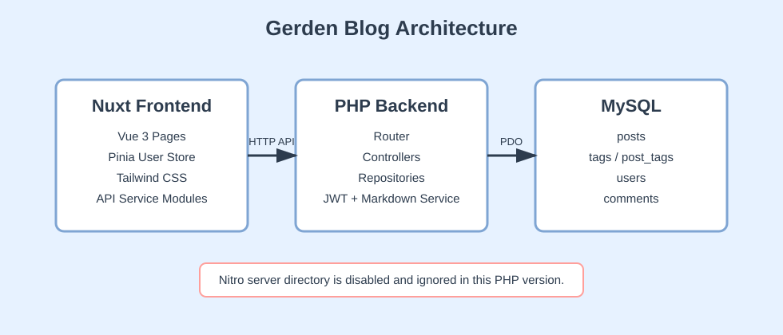
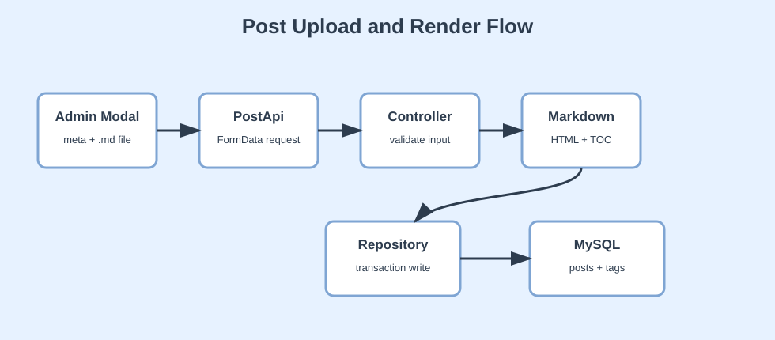
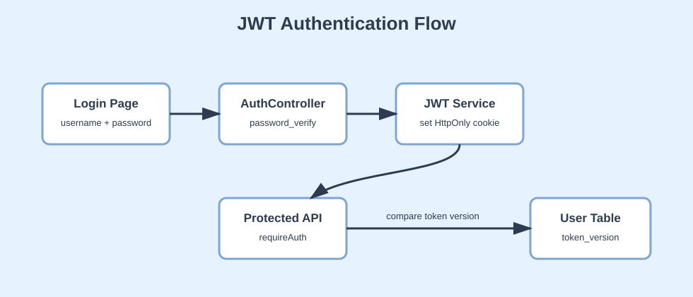

# Gerden Blog 项目文档

## 1. 项目概述

Gerden Blog 是一个个人博客系统，前端使用 Nuxt + Vue 3 + Pinia + Tailwind CSS，后端使用 PHP + PDO + MySQL。项目支持博客文章展示、Markdown 上传、后端 Markdown 转 HTML、文章目录 TOC、JWT 登录鉴权、后台文章管理，以及登录用户评论功能。

本项目早期曾经使用过 Nuxt 自带的 Nitro 服务，但当前版本已经切换为 PHP 后端。文档中的后端说明只针对 `backend/`，并明确忽略 `./server/*`。

核心目标：

- 前台用户可以浏览博客列表、博客详情和评论。
- 管理员可以登录后台，上传、更新、删除 Markdown 博客。
- 普通用户可以注册、登录、发表评论，并删除自己的评论。
- 管理员可以删除任意评论。
- 后端负责 Markdown 转 HTML 和 TOC 生成，前端只负责展示。

## 2. 技术栈

前端：

- Nuxt 4
- Vue 3
- TypeScript
- Pinia
- Tailwind CSS
- `$fetch` / `useFetch`

后端：

- PHP
- Composer
- PDO
- MySQL
- firebase/php-jwt
- Parsedown
- DOMDocument

数据库：

- `posts`
- `tags`
- `post_tags`
- `users`
- `comments`

## 3. 总体架构



系统分为三层：

1. Nuxt 前端负责页面、状态管理、API 调用和用户交互。
2. PHP 后端负责路由分发、参数校验、业务处理、鉴权和数据库访问。
3. MySQL 保存文章、标签、用户、评论等核心数据。

当前 Nuxt 配置中禁用了默认 server 目录，避免前后端服务混在一起：

```ts
export default defineNuxtConfig({
  modules: ['@pinia/nuxt'],
  serverDir: 'disabled-server',
  runtimeConfig: {
    public: {
      apiBase: process.env.NUXT_PUBLIC_API_BASE || 'http://localhost:8000/api'
    }
  }
})
```

这意味着前端请求会统一访问 PHP 服务，例如 `http://localhost:8000/api/posts`。

## 4. 目录结构

项目主要目录如下：

```txt
app/
  pages/              Nuxt 页面
  components/         复用组件
  services/           前端 API 模块
  stores/             Pinia 状态管理
  middleware/         路由中间件
  types/              TypeScript 类型
  assets/css/         全局样式与文章样式

backend/
  public/index.php    PHP 入口文件
  routes/api.php      API 路由注册
  src/Core/           Router / Response / Database
  src/Controllers/    控制器
  src/Repositories/   数据库访问层
  src/Services/       JWT / Markdown 服务
  src/Middleware/     鉴权中间件
  config/             数据库与鉴权配置

docs/
  project-documentation.md
  images/
```

`server/` 不参与当前 PHP 后端实现。

## 5. 后端启动流程

PHP 后端入口是 `backend/public/index.php`。它完成四件事：

1. 加载 Composer autoload。
2. 注册必要的 PHP 类文件。
3. 设置 CORS 和 Cookie 跨域配置。
4. 创建 Router 并加载 `routes/api.php`。

代表性代码：

```php
$loader = require __DIR__ . '/../vendor/autoload.php';
$loader->addPsr4('App\\', __DIR__ . '/../src');

header('Access-Control-Allow-Origin: http://localhost:3000');
header('Access-Control-Allow-Credentials: true');

$router = new Router();
require __DIR__ . '/../routes/api.php';

$method = $_SERVER['REQUEST_METHOD'];
$path = parse_url($_SERVER['REQUEST_URI'], PHP_URL_PATH);

$router->dispatch($path, $method);
```

开发时可以使用 PHP 内置服务器：

```bash
php -S localhost:8000 -t backend/public
```

前端开发服务器：

```bash
npm run dev
```

## 6. 路由设计

路由集中写在 `backend/routes/api.php`。项目没有使用大型 PHP 框架，而是通过自定义 Router 完成路径匹配。

代表性路由：

```php
$router->addPath('/api/posts', 'GET', [new PostsController(), 'index']);
$router->addPath('/api/posts/{slug}', 'GET', [new PostsController(), 'show']);
$router->addPath('/api/admin/posts', 'POST', [new PostsController(), 'store']);
$router->addPath('/api/admin/posts/{id}', 'DELETE', [new PostsController(), 'destroy']);
$router->addPath('/api/admin/posts/{id}/update', 'POST', [new PostsController(), 'update']);

$router->addPath('/api/register', 'POST', [new AuthController(), 'register']);
$router->addPath('/api/login', 'POST', [new AuthController(), 'login']);
$router->addPath('/api/me', 'GET', [new AuthController(), 'me']);

$router->addPath('/api/posts/{id}/comments', 'GET', [new CommentsController(), 'index']);
$router->addPath('/api/posts/{id}/comments', 'POST', [new CommentsController(), 'store']);
$router->addPath('/api/comments/{id}', 'DELETE', [new CommentsController(), 'destroy']);
```

路由匹配逻辑会比较请求路径和注册路径的片段数量，`{slug}`、`{id}` 这种片段会被解析成参数。因此 `/api/posts/{slug}` 不会错误匹配 `/api/posts/{id}/comments`，因为两者路径片段数量不同。

## 7. 数据库访问层

数据库连接由 `backend/src/Core/Database.php` 统一管理。项目使用 PDO，并设置异常模式，便于捕获数据库错误。

代表性代码：

```php
$dsn = sprintf(
  'mysql:host=%s;port=%s;dbname=%s;charset=%s',
  $config['host'],
  $config['port'],
  $config['database'],
  $config['charset']
);

self::$connection = new PDO($dsn, $username, $password, [
  PDO::ATTR_ERRMODE => PDO::ERRMODE_EXCEPTION,
  PDO::ATTR_DEFAULT_FETCH_MODE => PDO::FETCH_ASSOC,
  PDO::ATTR_EMULATE_PREPARES => false
]);
```

业务代码不直接拼接 SQL，而是通过 Repository 使用预处理语句。

## 8. 数据模型

核心关系如下：

```txt
users 1 ---- n comments
posts 1 ---- n comments
posts n ---- n tags
posts 1 ---- n post_tags
tags  1 ---- n post_tags
```

重点字段说明：

| 表 | 重点字段 | 说明 |
| --- | --- | --- |
| `posts` | `title`, `slug`, `summary`, `content`, `content_html`, `toc`, `post_status` | 保存 Markdown 原文、HTML 结果和 TOC |
| `tags` | `name`, `slug` | 标签信息 |
| `post_tags` | `post_id`, `tags_id` | 文章和标签的多对多关系 |
| `users` | `username`, `email`, `password_hash`, `role`, `status`, `token_version` | 用户、角色和 JWT 失效控制 |
| `comments` | `post_id`, `user_id`, `content`, `status` | 评论内容和逻辑删除状态 |

`posts.content` 保存 Markdown 原文，`posts.content_html` 保存后端渲染后的 HTML，`posts.toc` 保存目录数组。这样详情页读取时不需要再次转换 Markdown。

## 9. 博客文章实现过程

### 9.1 文章列表

前台文章列表接口是：

```txt
GET /api/posts
```

Repository 查询 `post_status = 'published'` 的文章，并通过 `LEFT JOIN` 同时查询标签。因为一篇文章可能有多个标签，SQL 返回的是多行数据，Repository 会按文章 id 聚合成前端需要的数组结构。

前端 `app/pages/posts/index.vue` 调用：

```ts
const { data } = await PostApi.getList()
const postList = computed(() => data.value?.data ?? [])
```

### 9.2 文章详情

详情接口是：

```txt
GET /api/posts/{slug}
```

后端通过 slug 查询文章详情，返回：

- 文章基础信息
- `contentHTML`
- `toc`
- 标签列表

前端详情页直接使用 `v-html` 渲染 HTML：

```vue
<div
  v-if="postDetail?.contentHTML"
  v-html="postDetail.contentHTML"
  class="post"
/>
```

由于 HTML 是后端用 Parsedown Safe Mode 生成的，前端主要负责展示，不需要再实现一套 Markdown 渲染逻辑。

## 10. Markdown 转 HTML 与 TOC

文章上传和更新时，后端读取 `.md` 文件内容，然后调用 `MarkdownService::render()`。

流程如下：



核心步骤：

1. Parsedown 将 Markdown 转成 HTML。
2. DOMDocument 解析 HTML。
3. 后端遍历真实的 `h1` 到 `h6`。
4. 为每个 heading 生成唯一 id。
5. 同时生成 TOC 数组。
6. 将带 id 的 HTML 和 TOC 一起写入数据库。

代表性代码：

```php
$parsedown = new \Parsedown();
$parsedown->setSafeMode(true);

$html = $parsedown->text($markdown);
$dom = new \DOMDocument('1.0', 'UTF-8');
$dom->loadHTML('<div id="markdown-root">' . $html . '</div>');

$headings = $xpath->query(
  './/*[self::h1 or self::h2 or self::h3 or self::h4 or self::h5 or self::h6]',
  $root
);
```

TOC 的核心原则是：目录 id 和正文 heading id 必须由同一套逻辑生成。这样可以避免 Markdown 原文中的代码块、缩进或特殊语法导致目录和正文错位。

生成结果示例：

```json
[
  { "id": "understanding-vue-3-reactivity", "text": "Understanding Vue 3 Reactivity", "depth": 1 },
  { "id": "using-ref", "text": "Using ref", "depth": 2 }
]
```

前端 TOC 渲染：

```vue
<li
  v-for="item in postDetail.toc"
  :key="item.id"
  :style="{ paddingLeft: (item.depth - 1) * 12 + 'px' }"
>
  <a @click.prevent="scrollToHeading(item.id)">
    {{ item.text }}
  </a>
</li>
```

点击目录时，前端通过 id 找到对应 heading：

```ts
function scrollToHeading(id: string) {
  document.getElementById(id)?.scrollIntoView({
    behavior: 'smooth',
    block: 'start'
  })
}
```

## 11. 文章创建、更新和删除

### 11.1 创建文章

创建接口：

```txt
POST /api/admin/posts
```

请求格式是 `multipart/form-data`：

- `meta`: JSON 字符串，包含标题、摘要、标签、状态。
- `file`: Markdown 文件。

前端封装：

```ts
const formData = new FormData()
formData.append('meta', JSON.stringify({
  title: post.title,
  summary: post.summary,
  tags: post.tags,
  post_status: 'published'
}))
formData.append('file', post.file)
```

后端控制器负责校验输入，Repository 负责事务写入：

```php
$rendered = MarkdownService::render($contentMd);

$payload = [
  'title' => $metaData['title'],
  'summary' => $metaData['summary'] ?? '',
  'tags' => $metaData['tags'] ?? [],
  'content' => $contentMd,
  'contentHTML' => $rendered['html'],
  'toc' => $rendered['toc'],
];

$createdPost = $this->PostRepo->create($payload);
```

Repository 中的事务会依次完成：

1. 生成 slug。
2. 插入 `posts`。
3. 查找或创建 `tags`。
4. 插入 `post_tags`。
5. commit。

如果中间失败则 rollback，避免文章和标签关系数据不一致。

### 11.2 更新文章

更新接口：

```txt
POST /api/admin/posts/{id}/update
```

虽然语义上更新常用 PUT，但这里使用 POST 是为了简化 `multipart/form-data` 文件上传处理。当前设计要求每次更新文章时重新上传 Markdown 文件，因为数据库保存了 Markdown 原文与 HTML，不保存本地文件路径。

更新逻辑重点：

- 使用文章 id 定位文章。
- 如果标题变化，则重新生成 slug。
- 重新渲染 Markdown，更新 `content_html` 和 `toc`。
- 删除旧的 `post_tags`，再写入新的标签关系。
- 更新 `updated_at`。

### 11.3 删除文章

删除接口：

```txt
DELETE /api/admin/posts/{id}
```

删除文章时会先删除 `post_tags` 关系，再删除 `posts`。这是硬删除文章，而评论部分采用的是逻辑删除。

## 12. JWT 鉴权实现

认证流程：



项目使用 JWT + HttpOnly Cookie。登录成功后，后端生成 JWT 并写入 Cookie；前端不直接保存 token，只保存用户基础信息到 Pinia 和 localStorage。

登录接口：

```txt
POST /api/login
POST /api/admin/login
```

普通登录和管理员登录复用同一套密码校验逻辑。管理员登录只额外判断 `role === 'admin'`。

代表性代码：

```php
if (!$user || !password_verify($password, $user['password_hash'])) {
  Response::error('用户名或密码错误', 401);
}

if ($user['status'] !== 'active') {
  Response::error('用户已被禁用', 403);
}
```

JWT payload 中包含 `token_version`：

```php
$payload = [
  'sub' => (int)$user['id'],
  'username' => (string)$user['username'],
  'role' => (string)$user['role'],
  'token_version' => (int)$user['token_version'],
  'iat' => $now,
  'exp' => $now + $expireSeconds,
];
```

每次访问受保护接口时，`AuthMiddleware::requireAuth()` 会：

1. 从 Cookie 读取 JWT。
2. 验证签名和过期时间。
3. 根据 `sub` 查询用户。
4. 判断用户是否 active。
5. 比对 JWT 中的 `token_version` 和数据库中的 `token_version`。

登出时，后端让 `token_version + 1`，旧 token 即使还没过期也会失效。

## 13. 前端认证状态管理

前端通过 Pinia 的 `users` store 管理用户状态：

- `user`
- `isLoggedIn`
- `isAdmin`
- `login`
- `adminLogin`
- `fetchMe`
- `fetchAdminMe`
- `logout`

代表性代码：

```ts
export const useUsersStore = defineStore('users', {
  state: () => ({
    user: null,
    initialized: false,
    loading: false
  }),

  getters: {
    isLoggedIn: (state) => state.user !== null,
    isAdmin: (state) => state.user?.role === 'admin'
  }
})
```

前端 API 插件统一设置 `credentials: 'include'`，确保浏览器会携带后端设置的 HttpOnly Cookie：

```ts
const api = $fetch.create({
  baseURL: config.public.apiBase,
  credentials: 'include',
  onResponseError({ response }) {
    if (response.status === 401) {
      useUsersStore().clearUser()
    }
  }
})
```

后台页面使用 `admin` 路由中间件保护：

```ts
export default defineNuxtRouteMiddleware(async () => {
  const usersStore = useUsersStore()

  try {
    await usersStore.fetchAdminMe()
    if (!usersStore.isAdmin) return navigateTo('/admin/login')
  } catch {
    return navigateTo('/admin/login')
  }
})
```

## 14. 评论功能实现

评论数据和用户、文章关联：

```txt
comments.post_id -> posts.id
comments.user_id -> users.id
```

评论接口：

| 方法 | 路径 | 权限 | 说明 |
| --- | --- | --- | --- |
| GET | `/api/posts/{id}/comments` | 公开 | 获取 visible 评论 |
| POST | `/api/posts/{id}/comments` | 登录用户 | 新增评论 |
| DELETE | `/api/comments/{id}` | 作者或管理员 | 逻辑删除评论 |

评论列表只查询 `status = 'visible'`：

```php
$comments = $this->commentsRepo->findByPostIdAndStatus($postId, 'visible');
```

删除评论不是物理删除，而是把状态改为 `deleted`：

```php
UPDATE comments
SET status = 'deleted', updated_at = NOW()
WHERE id = ? AND status <> 'deleted'
```

权限判断：

```php
$isOwner = (int)$comment['user_id'] === (int)$user['id'];
$isAdmin = $user['role'] === 'admin';

if (!$isOwner && !$isAdmin) {
  Response::error('无权限删除该评论', 403);
}
```

前端评论组件根据登录状态和角色决定操作：

- 未登录用户点击评论按钮会提示登录。
- 评论作者可以删除自己的评论。
- 管理员可以删除所有评论。

代表性代码：

```ts
const canDelete = (comment: CommentItem) => {
  const user = usersStore.user
  if (!user) return false

  return user.role === 'admin' || comment.user_id === user.id
}
```

## 15. 前端页面设计

### 15.1 首页

首页保持简约风格，展示欢迎语和个人介绍。内容包括：

- Gerden 身份介绍。
- GDUFS 学生。
- 前端开发者，正在学习全栈开发。
- 技术栈。
- GitHub 链接。
- 音乐爱好。

### 15.2 文章列表页

文章列表页调用 `PostApi.getList()`，展示所有 published 文章。每篇文章通过 slug 跳转到详情页。

### 15.3 文章详情页

详情页包含：

- 标题和摘要。
- 后端返回的 HTML 正文。
- TOC 侧边目录。
- 评论区。

详情页的 TOC 高亮通过 `IntersectionObserver` 实现，滚动时根据当前进入视口的 heading 更新 active id。

### 15.4 管理后台

后台页面包含：

- 文章列表。
- 上传按钮。
- 更新弹窗。
- 删除确认弹窗。
- 管理员登出。

文章新增和更新都使用同一个 Modal，区别由 `status` 控制。

## 16. API 返回格式

后端统一通过 `Response` 返回 JSON。

成功响应：

```json
{
  "status": "success",
  "message": "文章获取成功",
  "data": {}
}
```

失败响应：

```json
{
  "status": 404,
  "message": "文章不存在"
}
```

这种统一结构让前端可以使用通用的 `APIResponse<T>` 类型：

```ts
export interface APIResponse<T = unknown> {
  data: T
  status: 'success' | number
  message: string
}
```

## 17. 安全与边界处理

当前项目已经处理的点：

- 密码使用 `password_hash()` 加密。
- 登录使用 `password_verify()` 校验。
- JWT 存在 HttpOnly Cookie 中，减少前端 JS 直接读取 token 的风险。
- 通过 `token_version` 支持服务端主动让旧 JWT 失效。
- Markdown 使用 Parsedown Safe Mode。
- 数据库查询使用 PDO prepared statement。
- 评论删除使用权限判断。
- 后台文章接口使用 `requireAdmin()`。

后续可优化的点：

- 生产环境必须更换 `JWT_SECRET`。
- HTTPS 部署时将 Cookie `secure` 设置为 `true`。
- 增加上传文件大小限制。
- 增加更严格的 Markdown 文件 MIME 校验。
- CORS 根据生产域名配置，不应长期写死 `localhost:3000`。
- 后台列表接口可以单独提供 admin 版本，允许管理员看到 draft/hidden 文章。

## 18. 开发过程总结

本项目的实现过程可以概括为：

1. 搭建 Nuxt 前端基础页面和 Tailwind 样式。
2. 禁用 Nuxt Nitro server，确定 PHP 作为真实后端。
3. 创建 PHP 入口、Router、Response、Database 三个核心类。
4. 实现文章列表和详情接口。
5. 实现 Markdown 上传、后端渲染 HTML、TOC 生成。
6. 实现文章创建、删除、更新，并使用事务保证数据一致。
7. 引入 Composer 和 firebase/php-jwt，实现 JWT 鉴权。
8. 新增用户注册、普通登录、管理员登录、登出和 `/me` 接口。
9. 前端接入 Pinia，统一管理用户状态。
10. 修改前端中间件，根据登录状态和角色限制后台访问。
11. 新增评论表，实现评论列表、新增评论和逻辑删除。
12. 在文章详情页封装评论组件，并结合用户状态控制发布和删除权限。

最终项目形成了一个清晰的前后端分离结构：Nuxt 只负责前端交互，PHP 负责 API、鉴权和数据库，MySQL 负责持久化存储。

## 19. 运行与测试建议

后端：

```bash
cd backend
composer install
php -S localhost:8000 -t public
```

前端：

```bash
npm install
npm run dev
```

建议测试顺序：

1. `GET /api/health`
2. 注册普通用户。
3. 普通用户登录，检查 `/api/me`。
4. 管理员登录，检查 `/api/admin/me`。
5. 后台上传 Markdown 文章。
6. 前台查看文章列表和详情页 TOC。
7. 普通用户发表评论。
8. 评论作者删除自己的评论。
9. 管理员删除其他用户评论。
10. 更新文章并检查 slug、HTML、TOC 是否同步更新。

## 20. 项目特点

这个项目的重点不只是页面展示，而是完整实现了一个轻量博客系统从前端到后端的闭环：

- 前端有页面、API 模块、类型定义、状态管理和路由守卫。
- 后端有路由、控制器、仓库、服务层和中间件。
- 数据库设计覆盖文章、标签、用户和评论。
- Markdown 渲染与 TOC 生成在后端完成，保证前端展示简单稳定。
- JWT 鉴权没有使用 Redis，而是通过 `token_version` 解决 token 主动失效问题。
- 评论功能区分普通用户和管理员权限，符合真实博客系统的基础管理需求。
